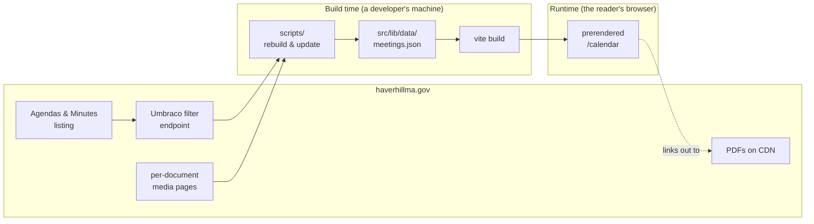

# How the meeting calendar works

This project publishes a browsable calendar of public meeting documents —
agendas and minutes — for the City of Haverhill, Massachusetts. The city
publishes those documents through a searchable file listing that is awkward to
browse and impossible to see chronologically. This site turns that listing into a
month calendar where every entry links straight to the source PDF.

## Documentation map

| Document                               | What it covers                                                      |
| -------------------------------------- | ------------------------------------------------------------------- |
| [scraping.md](./scraping.md)           | How documents are pulled off the city's site                        |
| [dates.md](./dates.md)                 | How a meeting date is determined, and why that is hard              |
| [data-format.md](./data-format.md)     | The `meetings.json` schema, field by field                          |
| [calendar-page.md](./calendar-page.md) | How the page renders, filters, and prerenders                       |
| [operations.md](./operations.md)       | Running the scripts, refreshing data, and what to do when it breaks |

## The shape of the system

There are two halves, joined by a committed data file and nothing else.



The important property: **the reader's browser never talks to the city's
servers**, except to follow a link to a PDF. All scraping happens ahead of time,
the results are committed to the repository, and the page is prerendered to
static HTML. Nothing about the site depends on the city's site being up, fast, or
CORS-friendly.

## Why the data is committed

The site uses `@sveltejs/adapter-static`, so every route is prerendered at build
time and served as plain files. That rules out fetching at request time, and
fetching from the browser would fail on CORS anyway. Committing the scraped data
also means:

- The data is reviewable. A refresh shows up as a readable diff.
- Builds are reproducible and offline. CI never depends on the city's uptime.
- Manual corrections survive. See [dates.md](./dates.md) for why that matters.

## Files at a glance

```
scripts/
  lib/haverhill.mjs        scraping and parsing: the endpoint, dates, classification
  lib/haverhill.spec.mjs   unit tests for the parsers
  lib/store.mjs            reading and writing meetings.json, run summaries
  rebuild-calendar.mjs     full re-scrape
  update-calendar.mjs      incremental refresh

src/lib/
  calendar.ts              pure date/grouping helpers used by the page
  calendar.spec.ts         unit tests for those helpers
  data/meetings.json       the committed dataset

src/routes/calendar/
  +page.ts                 build-time load: trims and de-duplicates records
  +page.svelte             the calendar UI
  page.svelte.e2e.ts       end-to-end tests
```

## Current dataset

As of the last refresh: **280 documents** spanning **2025-01-07 to 2026-08-27**,
across 10 boards. 279 resolve to a date; the one that does not is a schedule
document rather than a meeting.

| Board                              | Documents |
| ---------------------------------- | --------: |
| City Council                       |       138 |
| Conservation Commission            |        50 |
| License Commission                 |        43 |
| Administration & Finance Committee |        30 |
| Board of Assessors                 |         7 |
| Board of Registrars                |         5 |
| Health Department                  |         2 |
| Water Department                   |         2 |
| Cultural Council                   |         2 |
| Planning Board                     |         1 |

These numbers move every time the data is refreshed; the scripts print an updated
summary on each run.
